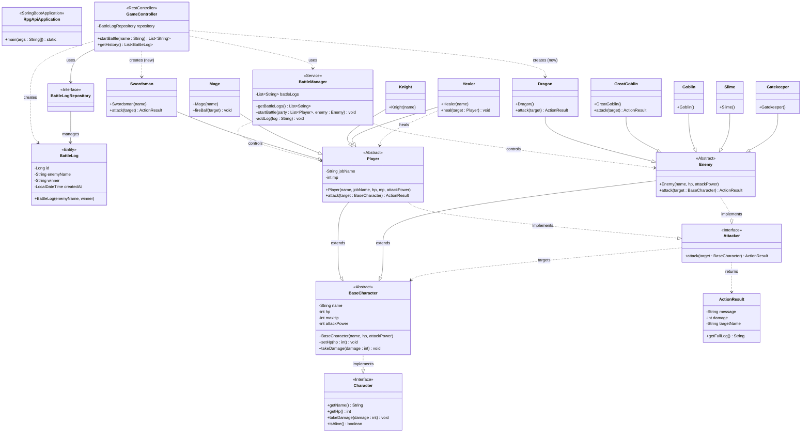

このプロジェクトは、IT 専門学校での学習成果を形にするために作成しました。 当初はコンソール上で動作する単純なプログラムでしたが、オブジェクト指向の理解を深めるためにリファクタリングを行い、最終的に Spring Boot を導入してブラウザから操作可能な Web アプリケーションへと進化させました。

🛠 使用技術（Tech Stack）
Language: Java 21

Framework: Spring Boot 3.2.2

Build Tool: Maven

Frontend: HTML5, CSS3, JavaScript (Fetch API)

Data Format: JSON (Jackson Library を使用)

Version Control: Git, GitHub

✨ 主な機能と特徴
オブジェクト指向に基づいた設計: 勇者（Player）やモンスター（Enemy）をクラス化し、継承やポリモーフィズムを活用。

Web API 化: RestController を実装し、戦闘ログを JSON 形式でフロントエンドに提供。

動的なログ表示: JavaScript の Fetch API を使い、ブラウザをリロードせずに戦闘結果をリアルタイムで反映。

整理されたディレクトリ構成: Maven の標準構造に準拠し、拡張性の高いパッケージ構成を採用。

📂 開発の背景とこだわり
成長の軌跡: 授業で学んだ Java やデータベース、ネットワークの知識を統合し、一つの成果物として完成させました。

エラー解決能力: Maven のビルドエラーや Spring Boot の設定トラブルを自力で調査・解決し、完遂させました。



----------------------------------------------------------


```mermaid
sequenceDiagram
    autonumber
    actor User as ユーザー
    participant Browser as ブラウザ(JS/HTML)
    box "Spring Boot Application" #f0f8ff
        participant Controller as GameController
        participant Manager as BattleManager
        participant Entity as BattleLog(記録)
        participant Repo as BattleLogRepository
    end
    participant DB as データベース(MySQL等)

    %% === 1. リクエスト開始 ===
    User->>Browser: 「冒険に出る」ボタンをクリック
    Note over Browser: JSが起動 (startBattle)
    Browser->>+Controller: GET /api/battle?name=勇者 (fetch)

    %% === 2. 準備フェーズ ===
    Note over Controller: 登場人物の準備(new)
    Controller->>Controller: new Swordsman("勇者")
    Controller->>Controller: new Dragon()
    Controller->>Manager: new BattleManager()

    %% === 3. 戦闘実行フェーズ ===
    Controller->>+Manager: startBattle(party, enemy)
    Note over Manager: ログをクリアして開始ログ記録
    %% ※実際のコードではここでattack()などは呼ばれておらず
    %% ログ追加のみが行われているため、内部処理として表現
    Manager->>Manager: addLog("戦闘開始...")
    Manager->>Manager: addLog("会心の一撃...")
    Manager-->>-Controller: 処理完了(void)

    %% === 4. 結果保存フェーズ ===
    Note over Controller: 勝敗判定と記録用データ作成
    Controller->>Entity: new BattleLog(敵名, 勝者)
    Entity-->>Controller: インスタンス生成

    Controller->>+Repo: save(log)
    Note over Repo, DB: Spring Data JPAが自動でSQLを発行
    Repo->>DB: INSERT INTO battle_log ...
    DB-->>Repo: 保存完了
    Repo-->>-Controller: 保存されたエンティティ

    %% === 5. レスポンスフェーズ ===
    Controller->>+Manager: getBattleLogs()
    Manager-->>-Controller: ログのリスト(List<String>)

    Controller-->>-Browser: JSONレスポンス (["⚔️戦闘開始...", ...])

    Note over Browser: 受け取ったJSONをHTMLに表示
    Browser->>User: 戦闘ログが画面に出る
    
